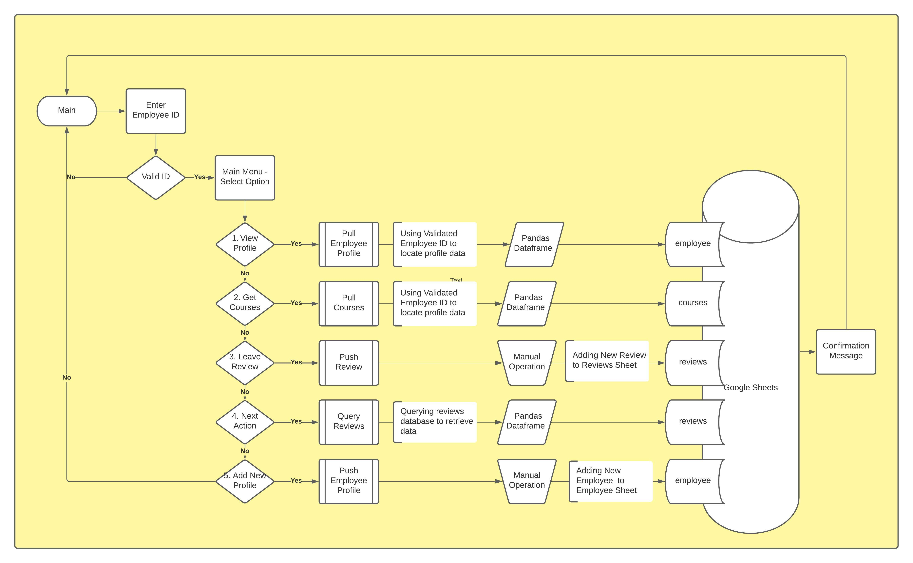
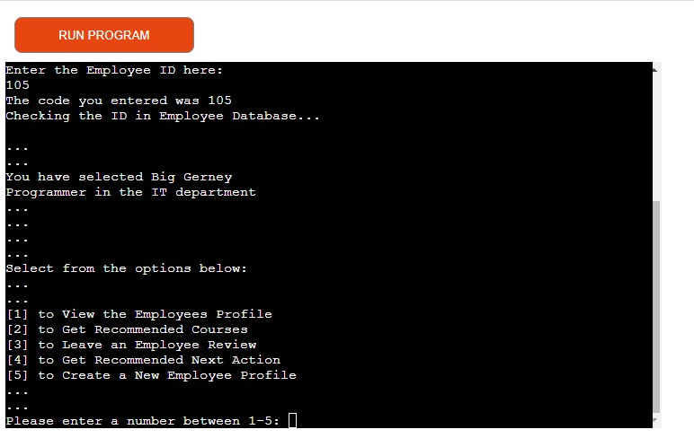

# The Hub

The Hub is an employee management tool for people managers. The idea is to gather and use information about the employee to help managers take the right actions at the right times. Information like when is my next performance review, how many new hires do we have in training. What should resouces can I offer in a performance review.
The hub is a place to make business rules and automate emails, content and next actions so that employees get the engagement they need and managers can spend less time on administation and more time on people.

## User Stories
**(Desired User Experience)

* As a new employee I want to receive information about my role so that I can be successful
* As a new employee I want to upskill in my role so that I can get do my work more efficiently
* As a new employee I want to have access to content relevant to my job so that I know what is expected of me
* As a Manager I want new employees to receive training material relevant to their role 
* As a Manager I want an easy way of setting up employees for success when they first start in the company
* As a Manager I want to log reviews for every stage of the employment journey
* Ad an Manager I want to know what the next best action for all employees

### Current Use Case 

* Title: See next action for an employee
* Actor: Manager
* Use Case:
	1. * A Manager enters an employee number
	2. * The number is used to retrieve information about the employee, their role and employment type
	3. * The manager then views the next recommended action
	4. * The system checks that they are passed probation so the next review is a performance review

* Title: Log a performance review
* Actor: Manager
* Use Case:
	1. * A Manager enters an employee number
	2. * The number is open a menu allowing them to select create employee review
	3. * The manager then inputs details about the review and rating
	4. * The system logs the review and feeds in to the business BI

### Future Use Case
* Title: Read information about my new company, my role
* Actor: New Starter
* Scenario:
	1. * The new starter opens the onboarding email in their email client
	2. * The new starter sees information about their team, their role and links to relevant training content.
	3. * The new stater clicks on the links to view more information
	4. * The links open to the company and training sites.

## Functional Requirements
* Retrieve data about employees
* Create an employee profile
* Create and log an employee review
* Search relevant training content for the employee's role

## Future Functionality
* Query the database and create business rules to notify managers and employees of when a review is due. 
* For example if the employee type is a 'new hire' and a training review is completed with a status of pass.
* Then update the employee type to 'probation' and next review date to 3 months from the last review date

* Format relevant onboarding content for the new starter in to an email
* Utilise API connecting to linkedin learning and populate the email with curated courses
* Send an email to the new starter and their manager

## Functions
* Start (main)
* Request employee id (get_id)
* Create an employee profile (get_profile)
* Confirm id is valid (validate_id)
* Main Menu (main_menu)
* Get the next recommended action for an employee (next_action)
* Retrieve Role Training Material (get_course)
* Add an employee review (add_review)
* Employee Profile Class (EmployeeProfile)
* Get full profile details (get_full_profile)
* Provide short employee summary (get_profile)
* Create an employee profile (add_employee)

## Process Flow

## Features
### Welcome Screen

### Please enter employee No
### Validate Employee Number

### Present Employee Summary

### Open Main Menu

### View Employee Profile

### Get Recommended Courses

### Leave an employee Review

### Get Recommended Next Action

### Create a new Employee Profile

## Testing
* All functions and flows above will submit data and produce a confirmation to the user
* The user can follow the journey from beginning to end for each of the functions and user stories
* See known errors below
* Tested the site on PEP8 [PEP8](http://pep8online.com/)
* Most errors removed except functions that are slightly longer than 80

## Known Errors
* Validation on the Main Menu Options
* Validation on the input fields in the add course and add employee
* Get next steps presenting two next steps down to the the iteration
* Space and formating when the main menu is called again after menu option completes
* The training courses and next steps were supposed to populate a formatted email but I have issues with server time outs and could not send from the terminal.

## Technologies In Use
### [Github](https://github.com/)
* Project repository
### [Gitpod](https://gitpod.io/)
* IDE for coding and testing
### [Heroku](heroku.com)
* Deployment site
### [Lucid](https://lucid.app/)
* Creating process flow
### [PEP8](http://pep8online.com/)
* Online Testing
### [Pandas] 
* Creating dataframes for analysis
### [GoogleSheets] ### [GoogleAPI]

## Deployment
### GitHub 
  - [Login](https://github.com/) to GitHub
  - Click "Repository" and select "New"
  - Give the repository a name and description and then click "Create repository"
  - Click "Gitpod" to start editing
  - In the terminal enter "python3 run.py" to run your code

### Heroku
* The project was deployed using [Heroku](https://www.heroku.com)
*  Navigate to your [heroku dashboard](https://dashboard.heroku.com/apps)
- Click "New" and select "Create new app".  
- Input a meaningful name for your app and choose the region best suited to
  your location.  
- Select "Settings" from the tabs.  
  - Click "Reveal Config Vars".  
  - Input `PORT` and `8000` as one config var and click add.  
  - Input `CREDS` and the content of your Google Sheet API creds file as another
    config var and click add.  
  - Click "Add buildpack".  
  - Add "nodejs" and "python" from the list or search if necessary, remember to
    click save.  
  - Python must be the first buildpack. They can be dragged into the correct
    position if needed.  
- Select "Deploy" from the tabs.  
  - Select "GitHub - Connect to GitHub" from deployment methods.  
  - Click "Connect to GitHub" in the created section.  
  - Search for the GitHub repository by name.  
  - Click to connect to the relevant repo.  
  - Either click `Enable Automatic Deploys` for automatic deploys or `Deploy
    Branch` to deploy manually. Manually deployed branches will need
    re-deploying each time the repo is updated.  
  - Click `View` to view the deployed site.  
- The live site can also be accessed from your repo in GitHub from the
  environments section of the repo.
  - Click the link to view deployments history.  
  - Click `View deployment`. This page also shows all the deployment history.  
The site is now live and operational

### Make a clone
- [Login](https://github.com/) to GitHub
  - Click "Repository" and select "project"
	- Click the "Code" dropdown menu.
  - Click "Clone with HTTPS" and copy the link
	- Open IDE "Ternimal" in local machine
  - Type "git clone" followed by URL
  - Press "Enter" to create clone
